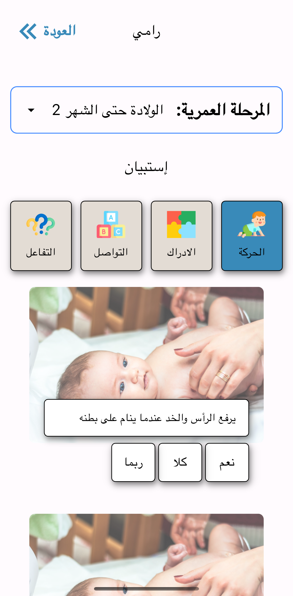

# Child Milestone Tracker

A Flutter-based application designed to help track child development milestones, providing parents and caregivers with a simple and efficient way to monitor progress.

---
## Features

- **Track Milestones and Vaccines**: Log and monitor developmental milestones and vaccines at different stages and ages.

- **Notifications**: Set reminders for important tasks and milestones.

- **Multi-language Support**: Configured for localization for a global audience.

- **Cross-Platform Compatibility**: Works on Android and iOS.

---
## Screenshots

<div align="center">
  
  
</div>
  

---
## Installation

1. Clone the repository:

```bash

git clone https://github.com/mtermos/child_milestone.git

cd child_milestone-master

```

2. Install dependencies:

```bash

flutter pub get

```

3. Run the app:

```bash

flutter run

```


---
## Project Structure
### **lib/**

The core logic and UI of the application reside here. Below is a detailed breakdown of its structure:

- **`main.dart`**: The entry point of the application.
- **`presentation/`**: contains the user interface (UI) components and screen layouts that define how the application visually interacts with users.
- **`logic/`**: contains the logic and the _BLoC_ state management components that handle the application's core functionality and behavior.
- **`data/`**: - manages data-related operations, including models, database, and repositories for fetching, storing, and processing application data.
- **`l10n/`**: Localization support (for different language usage).

- **`presentation/screens/`**: Contains the screens (pages) of the application.
- **`data/models/`**: Data models representing core entities.
    - `milestone.dart`: Represents a child milestone entity.
    - `user.dart`: Represents a user or parent entity.
- **`data/data_providers/`**: contains files to add static data to the app.
- **`data/dao/`**: contains Data Access Objects (DAOs) responsible for managing interactions with the database or local storage, such as querying, inserting, updating, and deleting data.
- **`data/repositories/`**: contains repository classes that serve as intermediaries between the data layer (DAOs, APIs, etc.) and the application logic.
- **`data/database/`**: contains the database setup and configuration files for local SQLite database.
- **`logic/blocs/`**: Contains Bloc (Business Logic Component) classes for managing complex state and event handling.
- **`logic/cubits/`**: Contains Cubit classes, a simpler version of Bloc, for managing state with minimal boilerplate where only state changes (no event handling) are required.
- **`logic/shared/`**: Contains shared logic or utilities that are reused across the application.
### **assets/**

The `assets/` directory contains resources like images and icons

---
## Contact

For questions or suggestions, reach out:

- **Email**: mortada.termos@gmail.com

